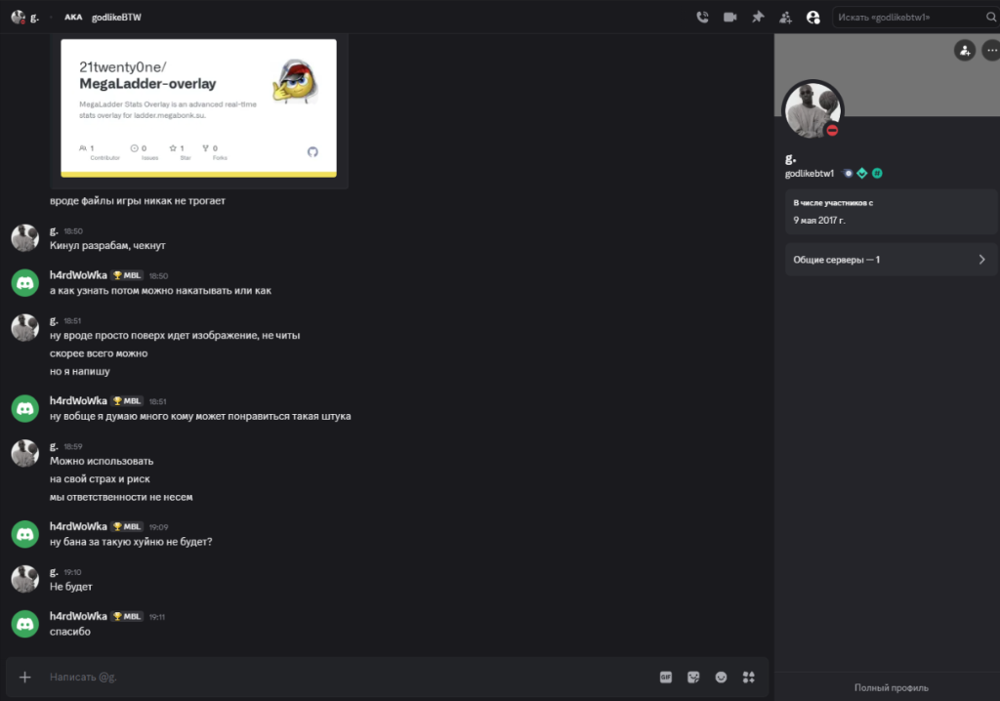
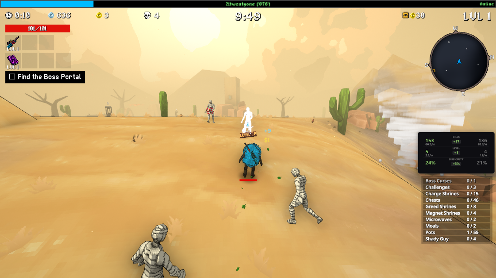
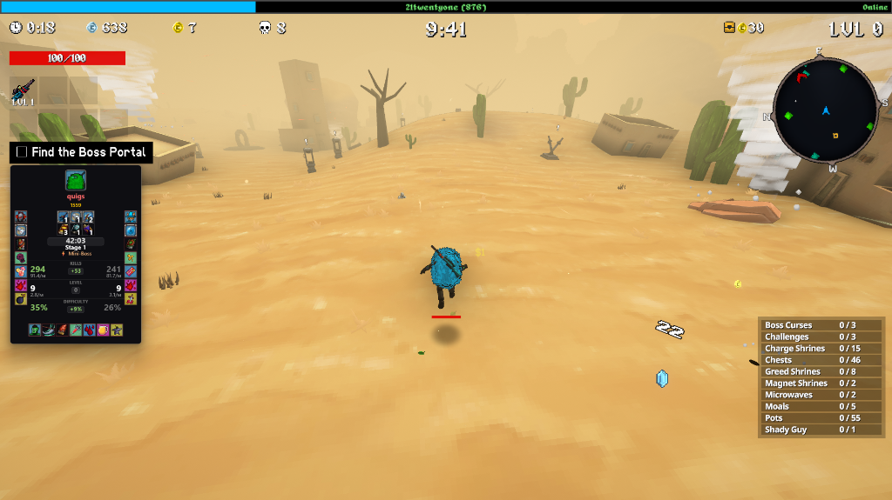

# MegaLadder Stats Overlay

[Русский](#инструкция-по-установке) | [English](#installation-guide)

---

## О проекте / About

**MegaLadder Stats Overlay** — продвинутый оверлей для отслеживания статистики в реальном времени на [ladder.megabonk.su](https://ladder.megabonk.su/). Поддерживает режим **Picture-in-Picture (PiP)** для размещения окна статистики поверх игры.

**MegaLadder Stats Overlay** is an advanced real-time stats overlay for [ladder.megabonk.su](https://ladder.megabonk.su/). Supports **Picture-in-Picture (PiP)** mode to place the stats window directly over your game screen.

### Основные возможности / Key Features
- 🎯 **Full Focus Mode** — ультра-компактный режим с отображением только разницы в киллах, уровне и сложности
  - 🎯 **Full Focus Mode** — ultra-compact mode showing only kill, level, and difficulty differences
- 🌍 **Локализация** — полная поддержка русского и английского языков
  - 🌍 **Localization** — full support for Russian and English languages
- 🎨 **Гибкая настройка** — масштабирование текста, иконок, прозрачность
  - 🎨 **Flexible Settings** — text scaling, icon sizing, opacity control
- 📊 **Детальная статистика** — аватары, билды, баны, таймеры событий
  - 📊 **Detailed Stats** — avatars, builds, bans, event timers

## 🛡️ Безопасность и Поддержка / Safety & Support

> **⚠️ Банят ли за использование?**
> **Нет.** Это браузерное расширение, которое работает исключительно как оверлей и **не взаимодействует с файлами игры**.
> _Безопасность использования подтверждена в личном диалоге с администрацией ладдера._
>
> 

### 📞 Обратная связь / Contact

Если у вас возникли вопросы, проблемы с установкой или есть предложения по улучшению:  
✍️ Напишите мне в Discord: **`21twentyone`**

Have questions, installation issues, or feature suggestions?  
✍️ Message me on Discord: **`21twentyone`**

---

## Скриншоты / Screenshots

| Общий вид / Overview | Мини-режим / Full Focus Mode |
|:---:|:---:|
|  |  |

| Сравнение статов / Stats | Меню / Settings & Visibility |
|:---:|:---:|
|  |  |

## Примеры в игре / In-Game Examples

| Компактный режим / Compact Mode | Полный режим / Full Mode |
|:---:|:---:|
|  |  |

---

## Инструкция по установке

### Способ 1: Через GreasyFork (рекомендуется)
1. Установите расширение **Tampermonkey** для вашего браузера:
   - [Tampermonkey для Chrome / Edge / Yandex / Vivaldi / etc](https://chrome.google.com/webstore/detail/tampermonkey/dhdgffkkebhmkfjojejmpbldmpobfkfo)
   - [Tampermonkey для Firefox](https://addons.mozilla.org/en-US/firefox/addon/tampermonkey/)

2. **Включите режим разработчика**:
   - Откройте страницу расширений браузера:
     - Chrome/Edge: `chrome://extensions/`
     - Firefox: `about:addons`
     - Opera: `opera://extensions/`
   - Или используйте горячие клавиши: `Ctrl + Shift + E` (Chrome/Edge), `Ctrl + Shift + A` (Firefox)
   - Включите **"Режим разработчика"** (Developer Mode)
   
   

3. Перейдите на страницу скрипта: **[MegaLadder Stats Overlay на GreasyFork](https://greasyfork.org/ru/scripts/562557-megaladder-stats-overlay)**
4. Нажмите кнопку **"Установить этот скрипт"**
5. Готово! Откройте [ladder.megabonk.su](https://ladder.megabonk.su/) и начните использовать оверлей

### Способ 2: Вручную через GitHub
1. Установите **Tampermonkey** (см. ссылки выше)
2. **Включите режим разработчика** (см. инструкцию выше)
3. Нажмите на иконку Tampermonkey в браузере и выберите **"Создать новый скрипт"**
4. Скопируйте содержимое файла [`megaladder overlay.user.js`](https://raw.githubusercontent.com/21twenty0ne/MegaLadder-overlay/main/megaladder%20overlay.user.js) и вставьте его в редактор
5. Нажмите **Файл -> Сохранить**

### Шаг 3: Использование
1. Откройте страницу лобби или матча на [ladder.megabonk.su](https://ladder.megabonk.su/).
2. В верхней части экрана появятся кнопки управления:
    - **АКТИВЕН / ОТКРЫТЬ**: Управление режимом "Картинка в картинке" (PiP).
    - **ВИДИМОСТЬ**: Настройка отображаемых элементов (аватары, билды, баны).
    - **НАСТРОЙКИ**: Выбор языка, масштаба текста и иконок.

> 💡 **Совет:** Вы можете настроить оверлей перед игрой, зайдя в любое лобби на вкладке [Watch Now](https://ladder.megabonk.su/ladder?tab=watchNow). Это позволит подобрать оптимальные настройки размера, прозрачности и отображаемых элементов.
>
> [!WARNING]
> **Режимы Full Focus и Focus Mode** ограничивают функциональность некоторых настроек. Для полного понимания всех возможностей оверлея рекомендуется сначала поэкспериментировать с настройками **без включения этих режимов**.

---

## Функции и возможности / Features & Capabilities

### 🎮 Режимы отображения / Display Modes

#### Полный режим / Full Mode
- **Аватары игроков** — отображение аватаров с индикацией победы/поражения
- **Имена и MMR** — никнеймы игроков и их рейтинг с изменениями
- **Билды** — оружие и тома с уровнями прокачки
- **Баны** — персональные и общие баны героев
- **Статистика** — убийства, уровень, сложность с показателями в минуту
- **Таймеры** — время игры и события (орды, мини-боссы)
- **Этапы** — текущий этап и предстоящие события

#### Режим фокуса на сопернике / Focus Rival Mode
- Отображение только статистики противника
- Компактное вертикальное расположение
- Идеально для узких экранов

#### Полный фокус / Full Focus Mode
- **Ультра-компактный режим** (60x60 пикселей)
- Только разница в ключевых показателях:
  - 🎯 **KILL** — разница в убийствах
  - 📊 **LEVEL** — разница в уровнях
  - 💪 **DIFF %** — разница в сложности
- Цветовая индикация (зелёный = преимущество, красный = отставание)

### ⚙️ Настройки / Settings

#### Видимость элементов / Element Visibility
- ✅ Аватары игроков / Player Avatars
- ✅ Имена / Names
- ✅ MMR рейтинг / MMR Rating
- ✅ Билды (оружие и тома) / Builds (weapons & tomes)
- ✅ Главный таймер / Main Timer
- ✅ Этапы и события / Stages & Events
- ✅ Мои баны / My Bans
- ✅ Баны врага / Enemy Bans
- ✅ Общие баны / Common Bans
- ✅ Таблица статистики / Stats Table

#### Параметры отображения / Display Parameters
- 📏 **Размер текста** — от 0.5x до 2.5x
- 🖼️ **Размер иконок билда** — от 0.5x до 2.0x
- 🚫 **Размер иконок бана** — от 0.5x до 2.0x
- 📐 **Ширина окна** — от 400 до 1000 пикселей
- 📏 **Высота окна** — от 20 до 2000 пикселей (авто-расчёт)
- 👁️ **Прозрачность** — от 0.1 до 1.0

#### Дополнительные опции / Additional Options
- 🌍 **Язык** — переключение между RU/EN
- ⏱️ **Раздельные таймеры** — отдельные таймеры для каждого игрока
- 🎯 **Режим фокуса** — отображение только противника
- 🔲 **Полный фокус** — минималистичный квадратный режим

### 🖼️ Picture-in-Picture (PiP)
- Размещение окна статистики **поверх игры**
- Перемещение и изменение размера окна
- Работает во всех современных браузерах
- Автоматическое обновление каждую секунду

---

## Installation Guide

### Method 1: Via GreasyFork (Recommended)
1. Install the **Tampermonkey** extension for your browser:
   - [Tampermonkey for Chrome / Edge / Yandex / Vivaldi / etc](https://chrome.google.com/webstore/detail/tampermonkey/dhdgffkkebhmkfjojejmpbldmpobfkfo)
   - [Tampermonkey for Firefox](https://addons.mozilla.org/en-US/firefox/addon/tampermonkey/)

2. **Enable Developer Mode**:
   - Open your browser's extensions page:
     - Chrome/Edge: `chrome://extensions/`
     - Firefox: `about:addons`
     - Opera: `opera://extensions/`
   - Or use keyboard shortcuts: `Ctrl + Shift + E` (Chrome/Edge), `Ctrl + Shift + A` (Firefox)
   - Enable **"Developer Mode"**
   
   

3. Visit the script page: **[MegaLadder Stats Overlay on GreasyFork](https://greasyfork.org/ru/scripts/562557-megaladder-stats-overlay)**
4. Click the **"Install this script"** button
5. Done! Open [ladder.megabonk.su](https://ladder.megabonk.su/) and start using the overlay

### Method 2: Manual Installation via GitHub
1. Install **Tampermonkey** (see links above)
2. **Enable Developer Mode** (see instructions above)
3. Click the Tampermonkey icon in your browser and select **"Create a new script"**
4. Copy the content of [`megaladder overlay.user.js`](https://raw.githubusercontent.com/21twenty0ne/MegaLadder-overlay/main/megaladder%20overlay.user.js) and paste it into the editor
5. Click **File -> Save**

### Step 3: Usage
1. Open any lobby or match page on [ladder.megabonk.su](https://ladder.megabonk.su/).
2. Control buttons will appear at the top:
    - **ACTIVE / OPEN**: Toggle Picture-in-Picture (PiP) mode.
    - **VISIBILITY**: Customize visible elements (avatars, builds, bans).
    - **SETTINGS**: Change language, text scale, and icon sizes.

> 💡 **Tip:** You can configure the overlay before playing by visiting any lobby on the [Watch Now](https://ladder.megabonk.su/ladder?tab=watchNow) tab. This allows you to fine-tune size, opacity, and visible elements.
>
> [!WARNING]
> **Full Focus and Focus Mode** limit the functionality of some settings. To fully understand all overlay capabilities, it's recommended to experiment with settings **without enabling these modes first**.

---

## Features & Capabilities

### 🎮 Display Modes

#### Full Mode
- **Player Avatars** — display avatars with win/loss indicators
- **Names and MMR** — player nicknames and rating with changes
- **Builds** — weapons and tomes with upgrade levels
- **Bans** — personal and common hero bans
- **Statistics** — kills, level, difficulty with per-minute metrics
- **Timers** — game time and events (swarms, mini-bosses)
- **Stages** — current stage and upcoming events

#### Focus Rival Mode
- Display only opponent's statistics
- Compact vertical layout
- Perfect for narrow screens

#### Full Focus Mode
- **Ultra-compact mode** (60x60 pixels)
- Only key metric differences:
  - 🎯 **KILL** — kill difference
  - 📊 **LEVEL** — level difference
  - 💪 **DIFF %** — difficulty difference
- Color indicators (green = advantage, red = behind)

### ⚙️ Settings

#### Element Visibility
- ✅ Player Avatars
- ✅ Names
- ✅ MMR Rating
- ✅ Builds (weapons & tomes)
- ✅ Main Timer
- ✅ Stages & Events
- ✅ My Bans
- ✅ Enemy Bans
- ✅ Common Bans
- ✅ Stats Table

#### Display Parameters
- 📏 **Text Size** — from 0.5x to 2.5x
- 🖼️ **Build Icon Size** — from 0.5x to 2.0x
- 🚫 **Ban Icon Size** — from 0.5x to 2.0x
- 📐 **Window Width** — from 400 to 1000 pixels
- 📏 **Window Height** — from 20 to 2000 pixels (auto-calculated)
- 👁️ **Opacity** — from 0.1 to 1.0

#### Additional Options
- 🌍 **Language** — switch between RU/EN
- ⏱️ **Separate Timers** — individual timers for each player
- 🎯 **Focus Mode** — display only opponent
- 🔲 **Full Focus** — minimalist square mode

### 🖼️ Picture-in-Picture (PiP)
- Place stats window **over the game**
- Move and resize the window
- Works in all modern browsers
- Auto-updates every second

---

## License

MIT License - see [LICENSE](LICENSE) file for details.

---

**Made with ❤️ for the MegaLadder community**
