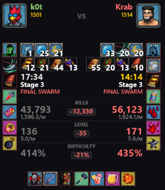
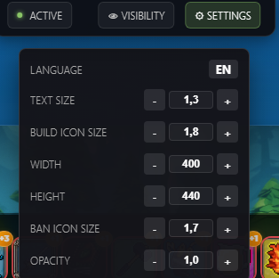

# MegaLadder Stats Overlay

[Русский](#инструкция-по-установке) | [English](#installation-guide)

---

## О проекте / About

**MegaLadder Stats Overlay** — продвинутый оверлей для отслеживания статистики в реальном времени на [ladder.megabonk.su](https://ladder.megabonk.su/). Поддерживает режим **Picture-in-Picture (PiP)** для размещения окна статистики поверх игры.

**MegaLadder Stats Overlay** is an advanced real-time stats overlay for [ladder.megabonk.su](https://ladder.megabonk.su/). Supports **Picture-in-Picture (PiP)** mode to place the stats window directly over your game screen.

### Основные возможности / Key Features
- 🎯 **Full Focus Mode** — ультра-компактный режим с отображением только разницы в киллах, уровне и сложности
  - 🎯 **Full Focus Mode** — ultra-compact mode showing only kill, level, and difficulty differences
- 🌍 **Локализация** — полная поддержка русского и английского языков
  - 🌍 **Localization** — full support for Russian and English languages
- 🎨 **Гибкая настройка** — масштабирование текста, иконок, прозрачность
  - 🎨 **Flexible Settings** — text scaling, icon sizing, opacity control
- 📊 **Детальная статистика** — аватары, билды, баны, таймеры событий
  - 📊 **Detailed Stats** — avatars, builds, bans, event timers

## Скриншоты / Screenshots

| Общий вид / Overview | Мини-режим / Full Focus Mode |
|:---:|:---:|
|  |  |

| Сравнение статов / Stats | Меню / Settings & Visibility |
|:---:|:---:|
|  |  |

---

## Инструкция по установке

### Способ 1: Через GreasyFork (рекомендуется)
1. Установите расширение **Tampermonkey** для вашего браузера:
   - [Tampermonkey для Chrome / Edge](https://chrome.google.com/webstore/detail/tampermonkey/dhdgffkkebhmkfjojejmpbldmpobfkfo)
   - [Tampermonkey для Firefox](https://addons.mozilla.org/en-US/firefox/addon/tampermonkey/)
2. Перейдите на страницу скрипта: **[MegaLadder Stats Overlay на GreasyFork](https://greasyfork.org/ru/scripts/562557-megaladder-stats-overlay)**
3. Нажмите кнопку **"Установить этот скрипт"**
4. Готово! Откройте [ladder.megabonk.su](https://ladder.megabonk.su/) и начните использовать оверлей

### Способ 2: Вручную через GitHub
1. Установите **Tampermonkey** (см. ссылки выше)
2. Нажмите на иконку Tampermonkey в браузере и выберите **"Создать новый скрипт"**
3. Скопируйте содержимое файла [`megaladder overlay.user.js`](https://raw.githubusercontent.com/21twenty0ne/MegaLadder-overlay/main/megaladder%20overlay.user.js) и вставьте его в редактор
4. Нажмите **Файл -> Сохранить**

### Шаг 3: Использование
1. Откройте страницу лобби или матча на [ladder.megabonk.su](https://ladder.megabonk.su/).
2. В верхней части экрана появятся кнопки управления:
    - **АКТИВЕН / ОТКРЫТЬ**: Управление режимом "Картинка в картинке" (PiP).
    - **ВИДИМОСТЬ**: Настройка отображаемых элементов (аватары, билды, баны).
    - **НАСТРОЙКИ**: Выбор языка, масштаба текста и иконок.

---

## Installation Guide

### Method 1: Via GreasyFork (Recommended)
1. Install the **Tampermonkey** extension for your browser:
   - [Tampermonkey for Chrome / Edge](https://chrome.google.com/webstore/detail/tampermonkey/dhdgffkkebhmkfjojejmpbldmpobfkfo)
   - [Tampermonkey for Firefox](https://addons.mozilla.org/en-US/firefox/addon/tampermonkey/)
2. Visit the script page: **[MegaLadder Stats Overlay on GreasyFork](https://greasyfork.org/ru/scripts/562557-megaladder-stats-overlay)**
3. Click the **"Install this script"** button
4. Done! Open [ladder.megabonk.su](https://ladder.megabonk.su/) and start using the overlay

### Method 2: Manual Installation via GitHub
1. Install **Tampermonkey** (see links above)
2. Click the Tampermonkey icon in your browser and select **"Create a new script"**
3. Copy the content of [`megaladder overlay.user.js`](https://raw.githubusercontent.com/21twenty0ne/MegaLadder-overlay/main/megaladder%20overlay.user.js) and paste it into the editor
4. Click **File -> Save**

### Step 3: Usage
1. Open any lobby or match page on [ladder.megabonk.su](https://ladder.megabonk.su/).
2. Control buttons will appear at the top:
    - **ACTIVE / OPEN**: Toggle Picture-in-Picture (PiP) mode.
    - **VISIBILITY**: Customize visible elements (avatars, builds, bans).
    - **SETTINGS**: Change language, text scale, and icon sizes.
